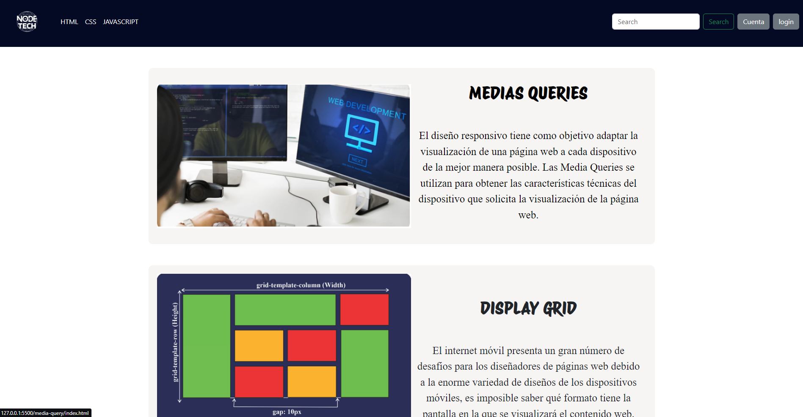
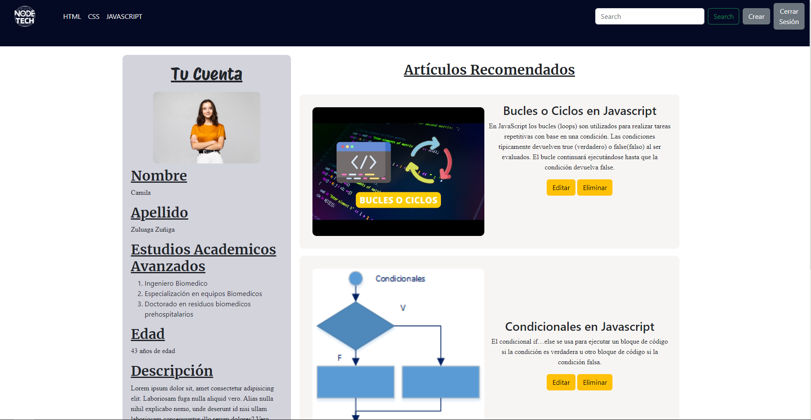
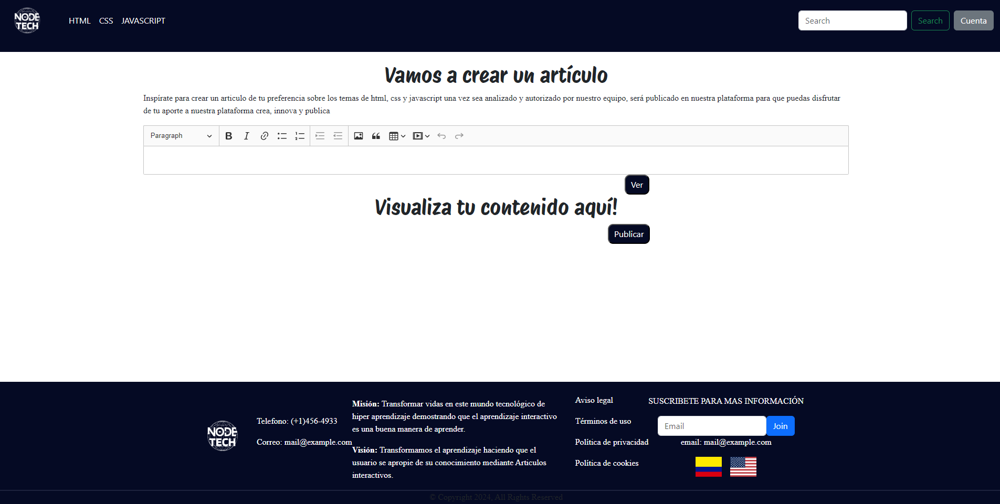

<h1>NODE TECH</h1>

Node tech nace por la necesidad que encontramos en la actualidad para los diferentes fuentes de información relacionadas al mundo tecnologico, en donde la industria exige en la mayor brevedad posible el conocimiento y la aplicabilidad de el mismo para el sistema de negocios. 

###

## **Tabla de Contenido**
* ¿Qué es Node Tech?
    * Objetivo General
    * Objetivos específicos
* Visualización
    * Landing Page
    * Cuenta
    * Creación de Artículos
* Característica
* Recursos
* Autores

## ¿Qué es Node Tech?
Node tech es una pequeña plataforma que busca brindar información sobre diversos temas, no nos limitamos a un solo tema ya que la idea principal de Node Tech es llegar a diferentes personas y así hacer crecer su comunidad.

En Node Tech hemos identificado que no todos aprendemos de la misma manera y mucho menos al mismo ritmo, es aquí donde entramos en acción, donde nuestros usuarios no solo pueden visualizar de manera organizada y detallada todos los temas que nuestros colaboradores han podido crear para brindar el mejor conocimiento.

También Node Tech es un proyecto que busca brindar soporte para que todas las personas, ya sean estudiantes o autodidactas, puedan disfrutar y resolver sus inquietudes y además puedan compartir parte de sus conocimientos accediendo a la sección de autores.

### *Objetivo General* 
Implementar una página web de artículos académicos interactivos creados por nuestros autores y colaboradores ya certificados facilitando así el aprendizaje de nuestros diferentes lectores.  

### *Objetivos Específicos* 
1. Analizar y resumir artículos publicados en el sitio web transformando su diseño a interactividad fácil y comprensible para nuestros usuarios.
2. Contenido actualizado de las diferentes temáticas presentadas hoy en día para el ámbito tecnológico.
3. Interactividad diseñada para facilitar el aprendizaje de los diferentes usuarios en nuestra página web.

## Visualización
Imagenes de la página implementada junto con sus respectivas funcionalidades

### *Landing Page* 

### *Cuenta* 

### *Crear Artículos* 

## Característica
La característica mas importante y que define a Node Tech es la capacidad que tiene para crear artículos de manera interactiva donde nuestros usuarios podran apropiarse de su aprendizaje ya sea con imagenes, videos y practicando al instante los conocimientos proporcionados en la misma página y esto es lo que hace a Node Tech diferente a los demás dando un aprendizaje de calidad a sus lectores y proporcionando a nuestros autores un sin fin de herramientas interactivas donde puedes crear, innovar y publicar.

## Recursos 
- [Json-server](https://www.npmjs.com/package/json-server)
- [Rapid Api](https://rapidapi.com/)
- [Boostrap 5](https://getbootstrap.com/)
- [Fetch](https://developer.mozilla.org/es/docs/Web/API/fetch)

## Autores
Los autores de este proyecto fueron 👧🏻[Angelica Martinez](https://developer.mozilla.org/es/docs/Web/API/fetchhttps://github.com/Angelica9924), 👦[Mateo Veléz](https://github.com/Mateo020528), 👦🏽[Maicol Agudelo](https://github.com/kemtch19) Agradecimientos especiales a [Juan Camilo](https://github.com/kemtch19?tab=following)

